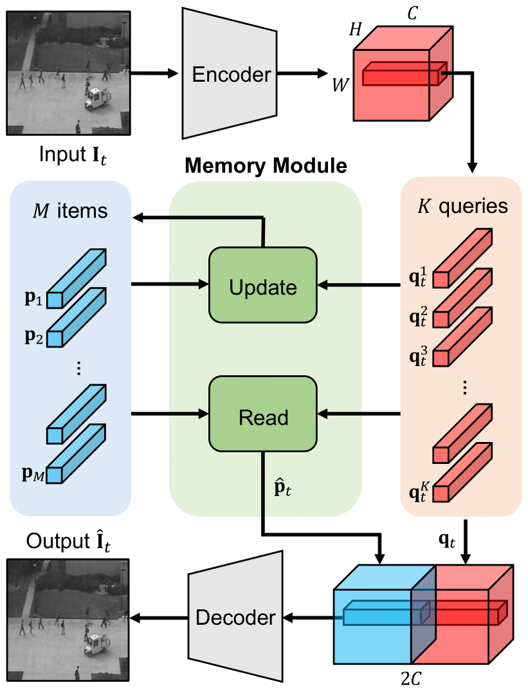
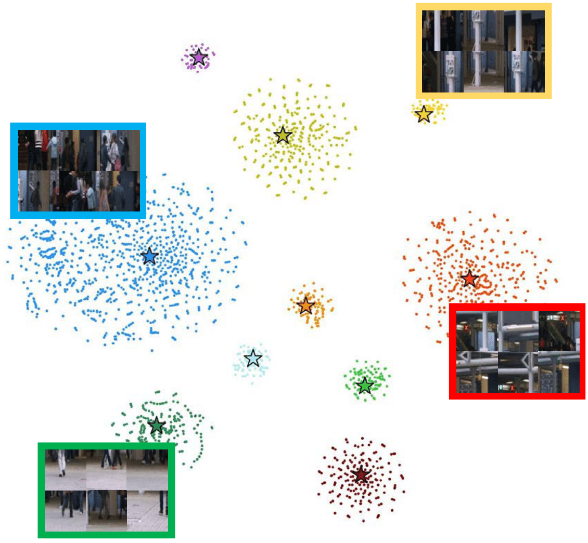

# PyTorch implementation of "Learning Memory-guided Normality for Anomaly Detection"

<p align="center"></p>
This is the implementation of the paper "Learning Memory-guided Normality for Anomaly Detection (CVPR 2020)".

For more information, checkout the project site [[website](https://cvlab.yonsei.ac.kr/projects/MNAD/)] and the paper [[PDF](http://openaccess.thecvf.com/content_CVPR_2020/papers/Park_Learning_Memory-Guided_Normality_for_Anomaly_Detection_CVPR_2020_paper.pdf)].

## Dependencies
* Python 3.6
* PyTorch 1.1.0
* Numpy
* Sklearn

## Datasets
* USCD Ped2 [[dataset](https://github.com/StevenLiuWen/ano_pred_cvpr2018)]
* CUHK Avenue [[dataset](https://github.com/StevenLiuWen/ano_pred_cvpr2018)]
* ShanghaiTech [[dataset](https://github.com/StevenLiuWen/ano_pred_cvpr2018)]

These datasets are from an official github of "Future Frame Prediction for Anomaly Detection - A New Baseline (CVPR 2018)".

Download the datasets into ``dataset`` folder, like ``./dataset/ped2/``

## Update
* 02/04/21: We uploaded the codes based on reconstruction method, and pretrained wieghts for Ped2 reconstruction, Avenue prediction and Avenue reconstruction.


## Training
* ~~The training and testing codes are based on prediction method~~
* Now you can implemnet the codes based on both prediction and reconstruction methods.
* The codes are basically based on the prediction method, and you can easily implement this as
```bash
git clone https://github.com/cvlab-yonsei/projects
cd projects/MNAD/code
python Train.py # for training
```
* You can freely define parameters with your own settings like
```bash
python Train.py --gpus 1 --dataset_path 'your_dataset_directory' --dataset_type avenue --exp_dir 'your_log_directory'
```
* For the reconstruction task, you need to newly set the parameters, *e.g,*, the target task, the weights of the losses and the number of the time sequence.
```bash
python Train.py --method recon --loss_compact 0.01 --loss_separate 0.01 --t_length 1 # for training
```

## Evaluation
* Test your own model
* Check your dataset_type (ped2, avenue or shanghai)
```bash
python Evaluate.py --dataset_type ped2 --model_dir your_model.pth --m_items_dir your_m_items.pt
```
* For the reconstruction task, you need to set the parameters as
```bash
python Evaluate.py --method recon --t_length 1 --alpha 0.7 --th 0.015 --dataset_type ped2 --model_dir your_model.pth --m_items_dir your_m_items.pt
```
* Test the model with our pre-trained model and memory items
```bash
python Evaluate.py --dataset_type ped2 --model_dir pretrained_model.pth --m_items_dir m_items.pt
```

## Pre-trained model and memory items
* Download our pre-trained model and memory items 
<br>[[Ped2 Prediction](https://drive.google.com/file/d/1NdsGKUPvdNNwsnWcMYeO44gX2h-oJlEn/view?usp=sharing)]
<br>[[Ped2 Reconstruction](https://drive.google.com/file/d/1HgntMYJd_Qn5L1wLnsz3xnbjGwbmd5uJ/view?usp=sharing)]
<br>[[Avenue Prediction](https://drive.google.com/file/d/1q7auxT21We9bg5ySsLP9HoqsxPATsd8K/view?usp=sharing)]
<br>[[Avenue Reconstruction](https://drive.google.com/file/d/1mFADg-97ZWXIvZ-tAcoN7hoCFHXMN7Gc/view?usp=sharing)]

* Note that, you need to set lambda and threshold to 0.7 and 0.015, respectively, for the reconstruction task. See more details in the paper.


## Bibtex
```
@inproceedings{park2020learning,
  title={Learning Memory-guided Normality for Anomaly Detection},
  author={Park, Hyunjong and Noh, Jongyoun and Ham, Bumsub},
  booktitle={Proceedings of the IEEE/CVF Conference on Computer Vision and Pattern Recognition},
  pages={14372--14381},
  year={2020}
}
```
